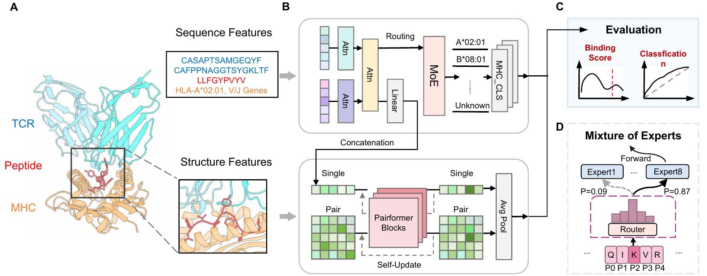

# SimuTCR: A Structure-Informed Multimodal Model with Residue-Level MoE for TCR–pMHC Binding Prediction	

## ⭐️ Introduction
This repository contains the source code for the paper “SimuTCR: A Structure-Informed Multimodal Model with Residue-Level MoE for TCR–pMHC Binding Prediction.”




SimuTCR is a Structure-informed multimodal model for jointly modeling the binding specificity of TCR α, TCR β, MHC, and peptide. Our approach integrates a sequence channel—designed to capture amino acid usage specificity by residue-lvel MoE and make MHC-restricted prediction—with a structure channel enhanced by AlphaFold3-generated features to capture the fusion knowledge of structure and sequence. 

## ⭐️ Setup 

1. Clone the repository.

```bash
git clone https://github.com/WangLabTHU/SimuTCR.git
```

2. Create a virtual environment by conda.

```bash
conda create -n SimuTCR python=3.9.21
conda activate SimuTCR
```

3. Install required Python packages.

```bash
pip install -r requirements.txt
```

> Note: The version of our implemention is 2.3.1+cu121. Prepare your own PyTorch with your CUDA version. 

You can download the datasets and model checkpints from 
[Datasets and checkpoints](https://zenodo.org/records/17695854)

After downloading, unzip the downloaded datasets/checkpoints in the `./datasets/` and `./results/` folders. 
(e.g data`./datasets/test_immrep23_unseen/0/0_token.pt`     checkpoint `./datasets/unseen.pt`)
Remember to modify the related model_paths in  `test` named python file.

# Usage

### 1. Training script

To train our model, just run

```
python -m ./scripts.train
```

The config file contains the settings of dataset type and hyperparameters.

In this repo, we provide a example config file for our model in `./config`. 


### 2. Inference 


Scripts with specific functions are provided in `./af3_binding/`:`
- `test.py`


To test our model, just run: 

```
python ./af3_binding/test.py
```

> Note: Remenber to modify the checkpoint_path and datasets_path to suit your needs. To reproduce our results, just follow the default setting.  

### 🧬 Inference on your own dataset

Put your `.csv` file in dataset with format like below (e.g. `./datasets/test_unseen.csv`): 

## License
MIT License 

